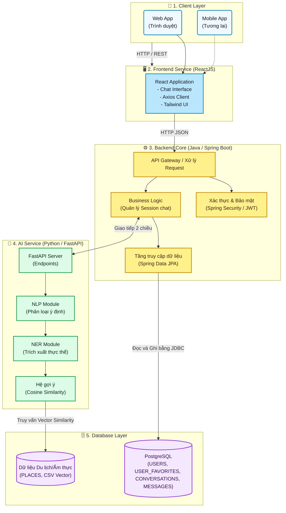

# Sơ đồ Kiến trúc Hệ thống (System Architecture)

Sơ đồ mô tả bức tranh tổng thể của dự án Chatbot với kiến trúc Microservices, bao gồm 3 service chính: Frontend (ReactJS), Backend Core (Spring Boot), và AI Service (FastAPI).

## Chú thích Kiến trúc:
1. **Frontend (ReactJS)**: Giao diện người dùng trực tiếp trải nghiệm Chatbot.
2. **Backend Core (Spring Boot)**: Không xử lý thuật toán AI mà đóng vai trò là xương sống (Backbone) của hệ thống: Quản lý user, lưu lại lịch sử tin nhắn vào PostgreSQL, điều phối các request chuyển hướng sang AI.
3. **AI Service (FastAPI)**: Chuyên trách tính toán AI. Nhận chuỗi văn bản thuần (Text) từ Backend, thực thi các thuật toán Machine Learning (NLP, NER) và Recommendation (Cosine Similarity), tính toán để trả ra danh sách ID địa điểm/món ăn.
4. **PostgreSQL**: DBMS chính để lưu trữ dữ liệu người dùng, đoạn chat và danh sách địa điểm (Places & Food).
