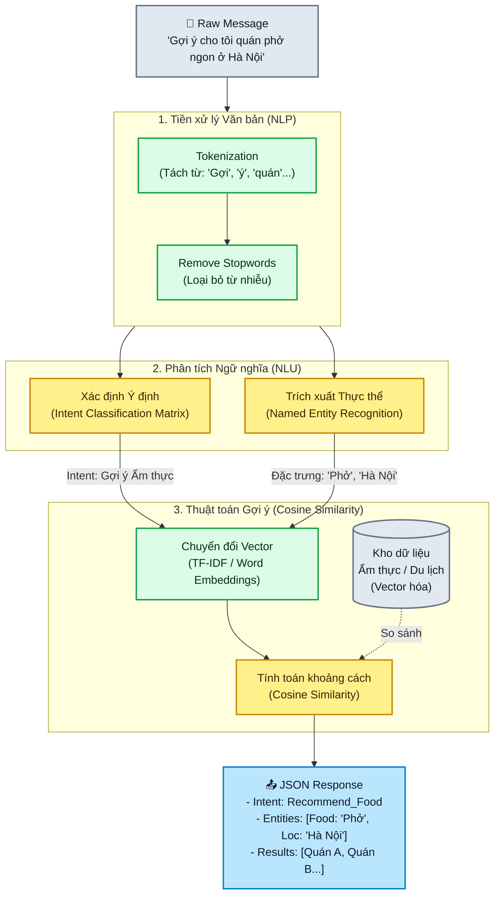

# Sơ đồ Luồng xử lý AI (AI Processing Flow)

Sơ đồ biểu diễn chi tiết các thuật toán Machine Learning được áp dụng trong **AI Service (FastAPI)**, bao gồm NLP Intent Classification, NER Extraction và Cosine Similarity Recommendation.

## Các Thuật toán Cốt lõi:
1. **Phân loại ý định (Intent Classification)**: AI xác định xem người dùng đang hỏi về Du lịch (Tìm điểm đến), Ẩm thực (Tìm quán ăn), hay Hỏi đáp thông thường (Small talk).
2. **Trích xuất thực thể (NER - Named Entity Recognition)**: Bóp tách các từ khoá mang ý nghĩa thực thể trong câu như: Tên món ăn ("Phở", "Bún chả"), Tên địa danh ("Hà Nội", "Đà Lạt"), Mức giá ("Rẻ", "Sang trọng").
3. **Độ tương đồng Cosine (Cosine Similarity)**: Khi đã có Intent và Entity, hệ thống chuyển hóa chúng thành các vector ngữ nghĩa (TF-IDF hoặc Word2Vec) và tính góc Cosine với dữ liệu quán ăn/địa điểm có sẵn trong CSDL để lọc ra Top N địa danh phù hợp nhất.
