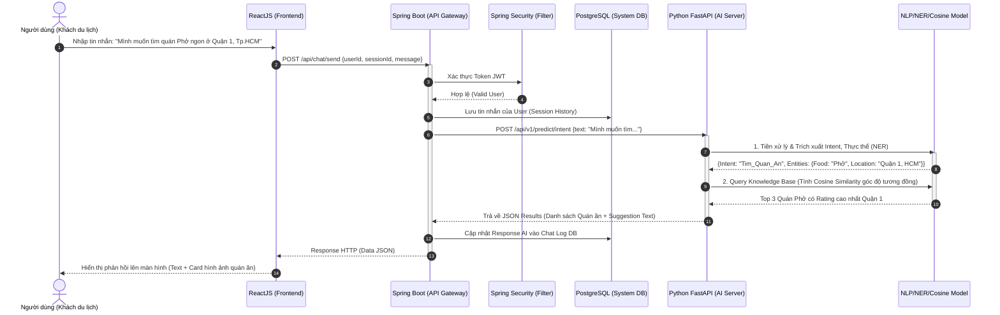

# Sơ đồ Luồng Tuần tự (Sequence Diagram)

Mô tả luồng tương tác giữa User, Frontend (React), Backend Core (Spring) và AI Service (FastAPI) từ khi gửi tin nhắn cho đến khi nhận được tư vấn.

## Chú thích luồng đi (Data Flow)
Sơ đồ giúp mô tả tính bất đồng bộ (Asynchronous) trong thiết kế hệ thống Microservices. Thay vì xử lý AI nặng nề trên Java/Spring (rất tốn kém), hệ thống Spring Boot đóng vai trò là Orchestrator chuyển giao (delegate) phần NLU/Cosine Similarity cực nặng sang cho Python (FastAPI).

Sơ đồ thể hiện rõ quá trình bóc tách thực thể (NER: `Phở` và `Quận 1`), sau đó gọi mô hình Vector Database để chạy hàm tính khoảng cách gần nhất (Cosine Similarity), cho ra top 3 kết quả trả về.
