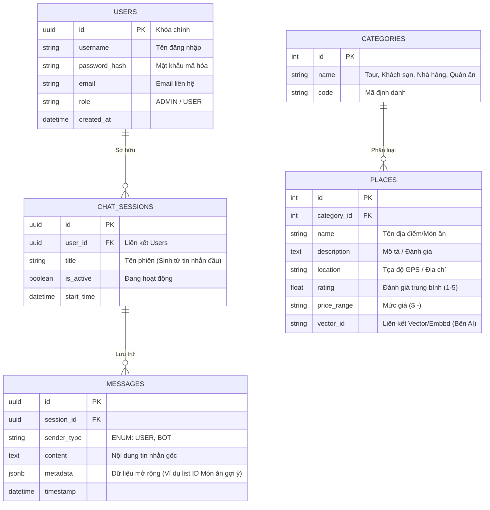

# Sơ đồ Cơ sở Dữ liệu (Database ERD - PostgreSQL)

Sơ đồ biểu diễn mô hình thực thể quan hệ (Entity Relationship Diagram - ERD) trong lõi CSDL PostgreSQL của hệ thống. Đây là nơi Spring Boot (JPA/Hibernate) kết nối để thêm sửa xoá dữ liệu.

## Chú giải thiết kế Database (RDBMS + JSONB)
1. **Liên kết Chặt chẽ (RDBMS)**: Hệ thống sử dụng khóa chính (Primary Key) là `UUID` cho các bảng liên quan đến user/chat để tăng cường bảo mật và tránh lỗi khi đồng bộ phân tán (Distributed ID).
2. **Trường dữ liệu JSONB (PostgreSQL)**: Bảng `MESSAGES` sử dụng tính năng cực mạnh của Postgres là kiểu `JSONB` cho cột `metadata`. Mặc dù dùng CSDL Quan hệ nhưng chúng ta vẫn có thể linh hoạt lưu danh sách ID địa điểm tư vấn của con Bot (ví dụ: `[{"placeId":1,"name":"Phở"}]`) trực tiếp trong này mà không cần tạo thêm bảng Many-to-Many làm dư thừa thiết kế.
3. **Places Data**: Bảng `PLACES` sẽ lưu trữ mô tả của mọi quán ăn và địa danh. Cột `vector_id` sẽ map với Model Vector lưu trên server Python (FastAPI).
