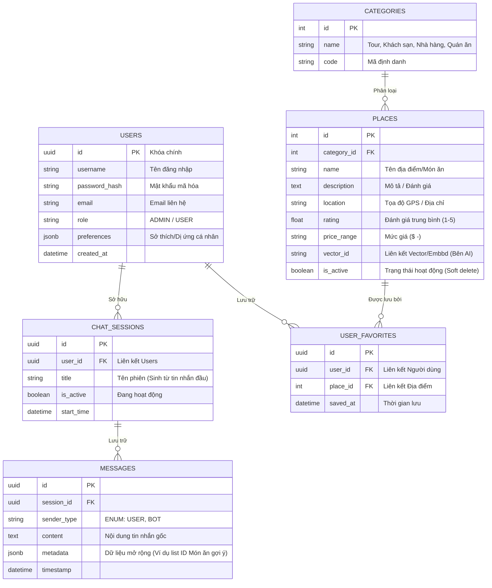

# Sơ đồ Cơ sở Dữ liệu (Database ERD - PostgreSQL)

Sơ đồ biểu diễn mô hình thực thể quan hệ (Entity Relationship Diagram - ERD) trong lõi CSDL PostgreSQL của hệ thống. Đây là nơi Spring Boot (JPA/Hibernate) kết nối để thêm sửa xoá dữ liệu.

## Chú giải thiết kế Database (RDBMS + JSONB)
1. **Liên kết Chặt chẽ (RDBMS)**: Hệ thống sử dụng khóa chính (Primary Key) là `UUID` cho các bảng liên quan đến user/chat để tăng cường bảo mật.
2. **Trường dữ liệu JSONB (PostgreSQL)**: 
   - Cột `metadata` (Bảng `MESSAGES`) hỗ trợ lưu linh hoạt danh sách các ID địa điểm gợi ý.
   - Cột `preferences` (Bảng `USERS`) hỗ trợ lưu vô số lượng tùy biến về sở thích khách hàng (VD: dị ứng hải sản, thích ăn mặn...) để AI lọc kết quả mà không cần sửa cấu trúc cột tĩnh truyền thống.
3. **Danh sách yêu thích (`USER_FAVORITES`)**: Giải quyết tính năng cực kỳ thiết thực cho dự án - cho phép người dùng lưu lại danh sách các quán ăn mong muốn từ các lượt gợi ý của AI.
4. **Soft Delete (`is_active` - `PLACES`)**: Giữ lịch sử Chat không bị Null Reference khi một địa điểm kinh doanh đóng cửa và bị gỡ khỏi ứng dụng. Bảng `PLACES` cũng đảm nhận lưu `vector_id` để map lên VectorDB bên Python.
